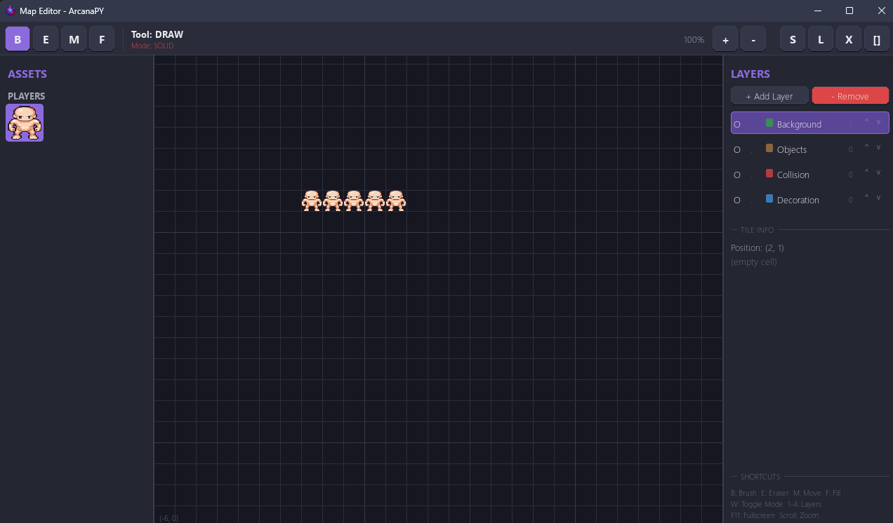

<div align="center">

 <h2>ArcanaPY</h2>

[](https://github.com/BloodLetters/ArcanaPY/commits/main)
[](https://github.com/BloodLetters/ArcanaPY)

<b>ArcanaPy</b> ArcanaPy is a lightweight 2D top-down game engine built using Python and Pygame.

Designed primarily for educational purposes, this engine serves as a foundation for understanding game development mechanics. Please keep in mind that ArcanaPy is a passion project developed by a small team of three people; while we are proud of its current state, it is a work in progress!
</div>

## Preview


## Installation
```bash
git clone https://github.com/BloodLetters/ArcanaPY.git
pip install -r requirements.txt
```

### Running Editor
```bash
python editor/app.py
```

### Running Game
```bash
python main.py
```
